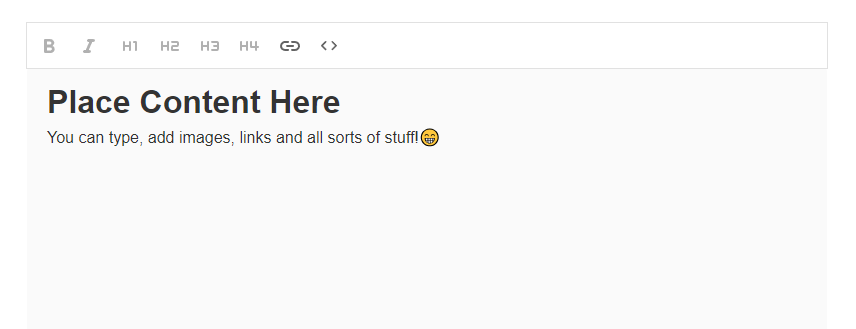

# React WYSIWYG Editor



A simple WYSIWYG (What You See Is What You Get) editor built using React.

## Features

- **Content Editing**: Edit text, add images, and format content easily.
- **Text Formatting**: Bold, italic, underline, and more formatting options.
- **Insert Media**: Add images and links seamlessly.
- **Responsive**: Works well on desktop and mobile browsers.
- **Customization**: Easily extendable and customizable.

## Installation

To run this project locally, clone the repository and run the following commands:

```bash
git clone <repository-url>
cd react-wysiwyg-editor
npm install
npm start
Usage
Open the editor in your browser.
Start editing content directly in the WYSIWYG interface.
Use toolbar options to format text, add links, and insert media.
Save or use the edited content as needed.
License
This project is licensed under the MIT License - see the LICENSE file for details.

Contributing
Contributions are welcome! Please feel free to submit a pull request.

Acknowledgments
Built with React
Icons from Font Awesome
Support
For support, contact your-email@example.com.

Note: Replace <repository-url> with the actual URL of your repository.

markdown
Copy code

### Explanation:

- **Project Description**: Provides a brief overview of what the project is about and includes an image (replace `wysiwyg-screenshot.png` with an actual screenshot of your editor).

- **Features**: Lists key features of your WYSIWYG editor.

- **Installation**: Provides instructions on how to clone the repository, install dependencies, and run the project locally.

- **Usage**: Briefly explains how users can use the WYSIWYG editor.

- **License**: Mentions the project's license (MIT License) and links to the `LICENSE` file for detailed information.

- **Contributing**: Encourages contributions and mentions how to submit them.

- **Acknowledgments**: Credits any external libraries or resources used in the project.

- **Support**: Provides contact information for support.

Feel free to customize and expand this template based on additional details specific to your project or any additional features you'd like to highlight.